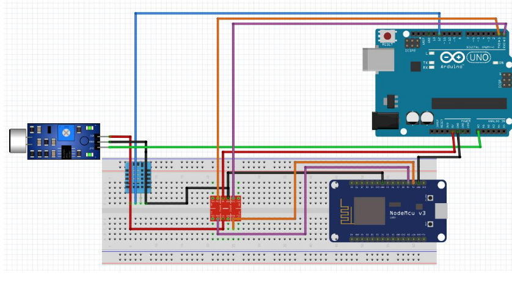
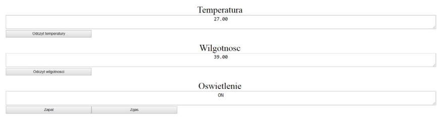

# miniserver-esp8266-websocket
miniserver esp8266 websocket connected with arduino and sensors

1. Architektura układu.

Do budowy projektu zostało użyto:

- Arduino Uno

- ESP8266

- konwerter stanów logicznych

- czujnik dźwięku

- czujnik temperatury i wilgotności DHT11.

Dane pomiędzy Arduino, a ESP8266 są przesyłane za pomocą transmisji szeregowej. Dane z
ESP8266 na serwer przesyłane są za pomocą sieci Wi-fi. Strona została utworzony przy
użyciu HTML, a działanie serwera z użyciem Websocket za pomocą JavaScript.
Czujnik dźwięku został połączony w następujący sposób:
- Zasilanie do pinu VL konwertera
- Masa do pinu GND Arduino
- Wyjście analogowe do pinu A0 Arduino
Czujnik DHT11 został połączony Zasilanie do pinu Vlow konwertera
- Masa do pinu GND Arduino
- Wyjściowe cyfrowe do pinu 12 Arduino
Arduino zostało podłączone w następujący sposób:
- Napięcie 5V do pinu VH konwertera
- Masa do pinu GND konwertera
- Pin 0(RX) podłączony do konwertera w taki sposób, aby łączył się z pinem TX
ESP8266
- Pin 1(TX) podłączony do konwertera w taki sposób, aby łączył się z pinem RX
ESP8266

ESP8266 jest podłączone w następujący sposób:
- Masa do pinu GND konwertera
- Pin RX podłączony do konwertera w taki sposób, aby łączył się z pinem 1(TX)
Arduino
- Pin TX podłączony do konwertera w taki sposób, aby łączył się z pinem 0(RX) Arduino

2. Potrzebne biblioteki i oprogramowanie.

Arduino IDE https://www.arduino.cc/en/Main/Software
Tutorial jak używać ESP8266 w Arduino IDE https://randomnerdtutorials.com/how-to-installesp8266-
board-arduino-ide/
Biblioteka ArduinoJSON5.13.5 https://www.arduinolibraries.info/libraries/arduino-json
Biblioteka DHT1.3.4 https://www.arduinolibraries.info/libraries/dht-sensor-library
Przykład, na którym wzorowany był kod obsługujący WebSockety
https://www.hackster.io/brzi/nodemcu-websockets-tutorial-3a2013
Biblioteka Web Socket https://github.com/Links2004/arduinoWebSockets

3. Działanie websocket podczas zdarzenia wygenerowanego przez serwer.

Po kliknięciu jednego z 4 przycisków, który jest wyświetlony na stronie, dzieje się określona
akcja:
- „Odczyt temperatury” – do ESP8266 przesyłany jest znak ‘z’, który następnie jest
przesyłany do Arduino, które dekoduje te dane oraz przesyła obiekt JSON z
aktualnym odczytem temperatury do ESP8266, które wyświetla te dane na serwerze
- „Odczyt wilgotnosci” – do ESP8266 przesyłany jest znak ‘x’, który następnie jest
przesyłany do Arduino, które dekoduje te dane oraz przesyła obiekt JSON z
aktualnym odczytem wilgotności do ESP8266, które wyświetla te dane na serwerze
- „Zapal” – do ESP8266 przesyłany jest znak ‘c’, który następnie jest przesyłany
do Arduino, które dekoduje te dane, zapala diodę oraz przesyła obiekt JSON ze
stanem diody („ON”) do ESP8266, które wyświetla te dane na serwerze
- „Zgas” – do ESP8266 przesyłany jest znak ‘b’, który następnie jest przesyłany
do Arduino, które dekoduje te dane, gasi diodę oraz przesyła obiekt JSON ze stanem
diody („OFF”) do ESP8266, które wyświetla te dane na serwerze

4. Działanie websocket podczas zdarzenia generowanego przez czujniki.

Dane z czujnika dźwięku są odczytywane co 5 milisekund co zostało zdefiniowane jako
zmienna interval w pliku „Sound_sensor_arduino”.

Jeśli zostanie wykryta nagła zmiana dźwięku w odniesieniu do poprzedniego odczytu i dioda
była w danym momencie zapalona to zostanie ona zgaszona. 
Jeśli dioda była zgaszona, to zostanie zapalona. 
Wiadomość o tym zdarzeniu zostanie przesłana na serwer przy pomocy obiektu JSON.
Dane z czujnika temperatury i wilgotności są odczytywane co 10 sekund,
co zostało zdefiniowane jako zmienna Tinterval w pliku „Sound_sensor_arduino”.

Jeśli zostanie wykryta zmiana temperatury w odniesieniu do poprzedniego odczytu,
to na serwer zostanie wysłany JSON z nową wartością temperatury.

Jeśli zostanie wykryta zmiana wilgotności w odniesieniu do poprzedniego odczytu,
to na serwer zostanie wysłany JSON z nową wartością wilgotności.
